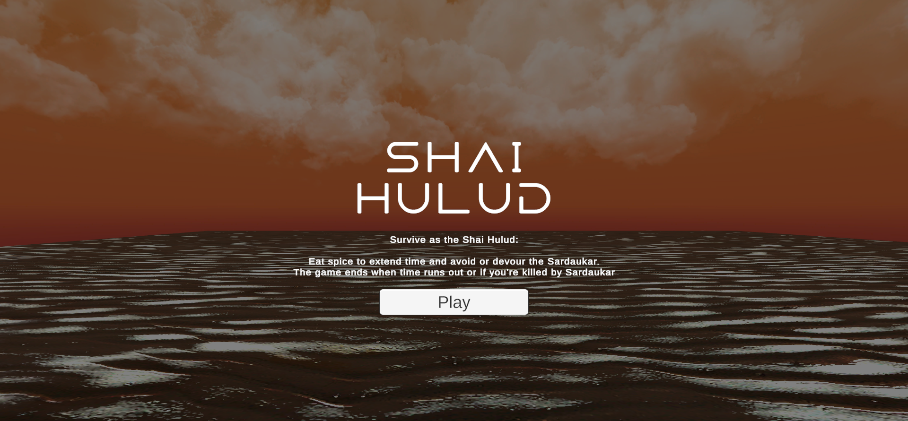
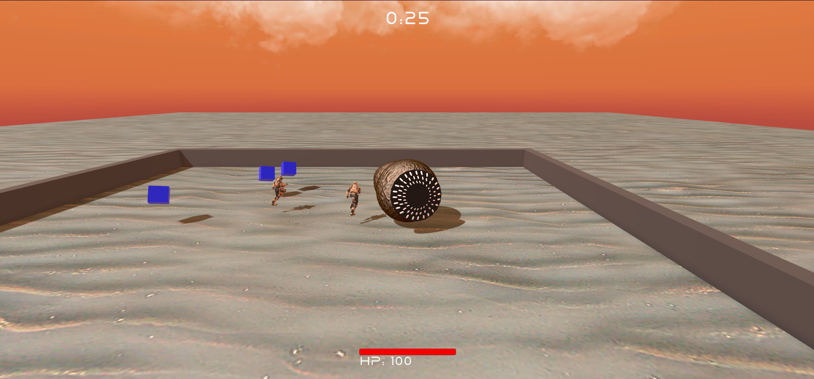

### Projeto Rollaball - Unity
Projeto desenvolvido para a disciplina de Jogos Digitais do Insper.

### Descrição
O projeto inicialmente consiste em um jogo de plataforma 3D, onde o jogador controla uma bola e deve coletar o maior número de cubos possíveis.

### Tema adotado e como jogar
Sobreviva como o Shai Hulud:

No deserto implacável de Arrakis, você é o Shai Hulud, uma criatura lendária e poderosa. Seu objetivo principal é devorar a preciosa especiaria, conhecida como "melange", para prolongar seu tempo de vida. Enquanto percorre as areias vastas, você deve evitar ou devorar os temíveis Sardaukar, guerreiros impiedosos que patrulham o deserto.

O jogo termina quando o tempo se esgota ou se você for abatido pelos Sardaukar. Use sua habilidade e astúcia para sobreviver o máximo possível neste ambiente hostil.

Controle o Shai Hulud com os comandos W, A, S, D para navegar pelo deserto e clique com o mouse para interagir com os botões dos menus. 

### Prints do jogo

### Vídeo do jogo
[Link para o vídeo](https://youtu.be/BycHLACX2ug)

### Créditos

- **Desenvolvedores:**
  - [Arthur Cisotto](github.com/arthurcisotto)
  
- **Assets:**
  - [Texturas de areia](https://assetstore.unity.com/packages/2d/textures-materials/floors/yughues-free-sand-materials-12964)
  - [Skybox](https://assetstore.unity.com/packages/2d/textures-materials/sky/free-stylized-hand-painted-skybox-265475)
  - [Modelo e animação do inimigo](https://www.mixamo.com/#/)
  - [Fonte utilizada](https://www.dafont.com/dune-rise.font)
  
- **Músicas:**
  - [Música de fundo](https://www.youtube.com/watch?v=BdtiYwSP9ko)
  - [Som de comer item/inimigo](https://www.youtube.com/watch?v=Nwk5NF9eSPk)
  - [Som de tomar dano](https://www.youtube.com/watch?v=OLJbtULNOaM)

- **Tutoriais:**
  -  [Tutorial de Rollaball](https://learn.unity.com/project/roll-a-ball)
  -  [Tutorial de Movimento de Minhoca (inspiração para o script de controle do jogador)](https://www.sharpcoderblog.com/blog/unity-3d-worm-controller)
